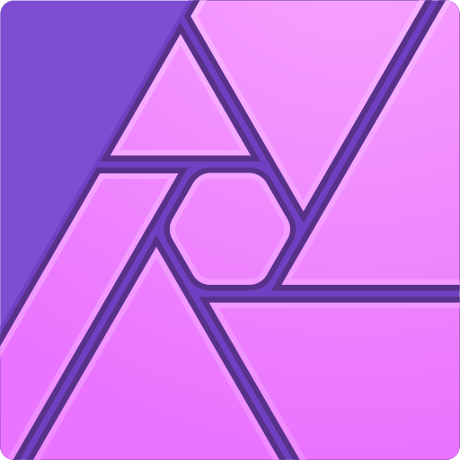
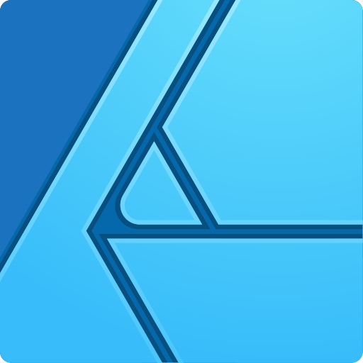
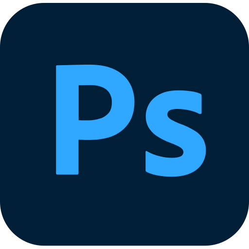
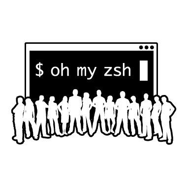
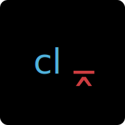
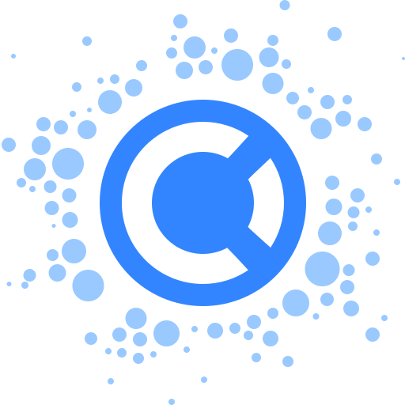

# **"Bromso"**, Fullstack Javascript Developer

### Summary

I am a highly creative person who can spin existing and/or create new digital business concepts to reach higher conversion rates.
My expertise have mainly been used within designing & programming: web applications, eCommerce sites, apps & regular websites.

Depending on product/service/brand, I can make digital strategies on how to market in the right channels with a cost effectively mindset.
I have a long experience from a variety of fields and are therefor not limited in my ideas and/or thinking.
I’ve worked my self up the production line and have deep knowledge of every aspect of the industry.

## Table of contents

- [Quick start](#quick-start)
- [What's included](#whats-included)
- [Bugs and feature requests](#bugs-and-feature-requests)
- [Documentation](#documentation)
- [Tech stack](#tech-stack)
- [Contributing](#contributing)
- [Community](#community)
- [Versioning](#versioning)
- [Quotes](#quotes)
- [Creators](#creators)
- [Thanks-to](#thanks-to)
- [Copyright and license](#copyright-and-license)

## Quickstart

```javascript
(async () => {
	const consultant = new Consultant({
		name: "Jonas Bröms",
		born: 529545600000,
		expertise: [
			"Concept",
			"Marketing",
			"UX Design",
			"Graphical Design",
			"Javascript",
			"NodeJS",
			"SEO",
			"Documentation",
		],
		moderate: [
			"3D Design",
			"Photography",
			"Cinematography",
			"Lighting",
			"Copywriting",
		],
	});

	consultant.beginNewJourney();

	do {
		await consultant.contactCustomers();
	} while (consultant.isSearchingForJob);

	consultant.makeAmazingSoftware();
})();
```

### Install

On Windows:

```
start mailto:jonasbroms@icloud.com?subject=Reconnect after I saw your Github profile
```

On Mac OSX:

```bash
open mailto:jonasbroms@icloud.com?subject=Reconnect after I saw your Github profile
```

**In the email, please explain:**

- Expected Hours to Work/Month
- Expected Salary/Hour
- Benefits
- Management Philosophy
- Work Methodology
- Culture
- Training/Development
- Tech Stack

## What's included

```text
🧔 Bromso
│
├── ⭕ Private
│		├┄┄ 🐣 1982.born
│		├┄┄ 🤼 1989.start.wrestling
│		├┄┄ 💾 1990.got.amiga500+
│		├┄┄ ⌨️ 1991.start.demoing
│		├┄┄ 🏀 1995.start.basketball
│		├┄┄ 🖥️ 1994.got.486intellmmx
│		├┄┄ 🌐 1995.first.lanparty
│		├┄┄ 🇵🇭 2006.travel.philippines
│		├┄┄ 🇭🇰 2006.travel.hongkong
│		├┄┄ 🇺🇸 2009.travel.usa
│		├┄┄ 🇫🇷 2012.travel.france
│		├┄┄ 💒 2013.got.married
│		├┄┄ 🇦🇪 2013.moved.unitedarabemirates
│		└─┄ 🇨🇾 2015.moved.cyprus
│
├── 🏫 School
│		├┄┄ 🎓 1997.graduate.primaryschool
│		├┄┄ 🎓 2001.graduate.highschool
│		├┄┄ 🎓 2003.graduate.university
│		├─┄ 🎓 2020.graduate.polytechnic.fullstackJS
│		└─┄ 🎓 2021.graduate.polytechnic.amazonAWS
│
└── 💼 Career
		├┄┄ 👨‍💻 1999.assistant.västfastigheter
		├┄┄ 👨‍💻 2004.technician.västfastigheter
		├┄┄ 🪖 2002.specialist.army
		├┄┄ 🎨 2004.designer.webcountryprod
		├┄┄ 🎥 2004.assistant.sverigestelevision
		├┄┄ 👔 2010.salesdirector.jonasolasspelab
		├┄┄ 🎨 2010.creativedirector.ewebbyrånab
		├┄┄ 👔 2016.marketingdirector.syncrasy
		├┄┄ 🎨 2017.creativedirector.cygroup
		└─┄ 🎨 present.creativedirector.odduse
```

### Why would I be a good fit?

I’m a highly energized, social person that sees marketing, design, user-experience & programming as a calling.

### What can I contribute with?

I've been called a hybrid by many of my collegues. I have the knowledge & experience to communicate with designers, marketers, programmers & executives.
My passion for tech and programming usually rubs off on any of the teams I’ve joined.

### Why do I want to work with you?

We’ve all seen different tech and programming languages come and go during years. Something that has been almost an absolute value out there, is HTML, CSS & foremost Javascript.
My opinion is that if you’ve chosen to build an app in Javascript as your main programming language, you are ready to meet the future and I would like to be apart of that future!

## Bugs & feature requests

### Known bugs

- [ ] Imposter-Syndrome i certain situations
- [ ] Highly Opinionated
- [ ] Sometimes being a toxic perfectionist which results that I push deadlines

### Feature requests

- [ ] Meditate more often & longer
- [ ] Be kinder to myself
- [ ] Exercise more

## Track record

These are some of the brands I've worked for during my years, either as a consultant or employee.

| <center><a href="https://www.volvocars.com/">Volvo</a></center>                                                                      | <center><a href="https://www.audi.com/">Audi</a></center>                                                                 | <center><a href="https://www.difc.ae/">DIFC</a></center>                                                                                                     | <center><a href="https://www.ica.se/">ICA</a></center>                                                       |
| ------------------------------------------------------------------------------------------------------------------------------------ | ------------------------------------------------------------------------------------------------------------------------- | ------------------------------------------------------------------------------------------------------------------------------------------------------------ | ------------------------------------------------------------------------------------------------------------ |
| <center><a href="https://www.volvocars.com/"></a></center> | <center><a href="https://www.audi.com/"></center> | <center><a href="https://www.difc.ae/"></a></center> | <center><a href="https://www.ica.se/"> |

| <center><a href="https://www.qmatic.com/">Qmatic</a></center>                                                                       | <center><a href="https://www.preem.se/">Preem</a></center>                                                                      | <center><a href="https://www.hardrock.com/">Hard Rock</a></center>                                                                               | <center><a href="https://www.cat.com/">Caterpillar</a></center>                                                                            |
| ----------------------------------------------------------------------------------------------------------------------------------- | ------------------------------------------------------------------------------------------------------------------------------- | ------------------------------------------------------------------------------------------------------------------------------------------------ | ------------------------------------------------------------------------------------------------------------------------------------------ |
| <center><a href="https://www.qmatic.com/"></a></center> | <center><a href="https://www.preem.se/"></a></center> | <center><a href="https://www.hardrock.com/"></a></center> | <center><a href="https://www.cat.com/"></a></center> |

## Open-Source Projects I've contributed to

| <center><a href="https://v2.grommet.io/">Grommet</a></center>                                                                                           | <center><a href="https://storybook.js.org/">Storybook</a></center>                                                                                                  | <center><a href="https://strapi.io/">Strapi</a></center>                                                                                                | <center><a href="https://cyprusjs.org/">CyprusJS</a></center>                                                                                                | <center><a href="https://semantic-release.gitbook.io/">Semantic-<br />Release</a></center>                                                                              | <center><a href="https://svgporn.com/">SVG Porn</a></center>                                                                           |
| ------------------------------------------------------------------------------------------------------------------------------------------------------- | ------------------------------------------------------------------------------------------------------------------------------------------------------------------- | ------------------------------------------------------------------------------------------------------------------------------------------------------- | ------------------------------------------------------------------------------------------------------------------------------------------------------------ | ----------------------------------------------------------------------------------------------------------------------------------------------------------------------- | -------------------------------------------------------------------------------------------------------------------------------------- |
| <center><a href="https://v2.grommet.io/"></a></center> | <center><a href="https://storybook.js.org/"></a></center> | <center><a href="https://strapi.io/"></a></center> | <center><a href="https://cyprusjs.org/"></a></center> | <center><a href="https://semantic-release.gitbook.io/"></a></center> | <center><a href="https://svgporn.com/"></a></center> |

## Tech stack

Technology I love and use in my daily life.

| Avatar                                                                                                                | Name                                                                  | Category           | Default | Year | Skill level         |
| --------------------------------------------------------------------------------------------------------------------- | --------------------------------------------------------------------- | ------------------ | ------- | ---- | ------------------- |
|                          | [Apple Macbook Pro](https://www.apple.com/macbook-pro/)               | Hardware           | TRUE    |      | ▰▰▰▰▰▰▰▱▱▱▱▱▱▱▱ 48% |
|                             | [Apple Mac OSX](https://www.apple.com/macos/)                         | Operating System   | TRUE    |      | ▰▰▰▰▰▰▰▱▱▱▱▱▱▱▱ 48% |
|  | [Microsoft Windows](https://www.microsoft.com/en-us/windows)          | Operating System   |         |      | ▰▰▰▰▰▰▰▱▱▱▱▱▱▱▱ 48% |
|                      | [Linux](https://www.linux.org/)                                       | Operating System   |         |      | ▰▰▰▰▰▰▰▱▱▱▱▱▱▱▱ 48% |
|                       | [Bash](https://www.gnu.org/software/bash/)                            | Operating System   |         |      | ▰▰▰▰▰▰▰▱▱▱▱▱▱▱▱ 48% |
|                          | [Figma](https://figma.com/)                                           | Web design         | TRUE    |      | ▰▰▰▰▰▰▰▱▱▱▱▱▱▱▱ 48% |
|                        | [Sketch](https://www.apple.com/)                                      | Web design         |         |      | ▰▰▰▰▰▰▰▱▱▱▱▱▱▱▱ 48% |
|                                  | [Affinity Photo](https://affinity.serif.com/en-us/photo/)             | Photo Editing      |         |      | ▰▰▰▰▰▰▰▱▱▱▱▱▱▱▱ 48% |
|                            | [Affinity Designer](https://affinity.serif.com/en-us/photo/)          | Vector Graphics    | TRUE    |      | ▰▰▰▰▰▰▰▱▱▱▱▱▱▱▱ 48% |
|                                 | [Photoshop](https://www.adobe.com/products/photoshop.html)            | Photo Editing      |         |      | ▰▰▰▰▰▰▰▱▱▱▱▱▱▱▱ 48% |
|                             | [Illustrator](https://www.adobe.com/products/illustrator.html)        | Vector Graphics    |         |      | ▰▰▰▰▰▰▰▱▱▱▱▱▱▱▱ 48% |
|                              | [Final Cut Pro](https://www.apple.com/final-cut-pro/)                 | Video Editing      | TRUE    |      | ▰▰▰▰▰▰▰▱▱▱▱▱▱▱▱ 48% |
|                                      | [Motion](https://www.apple.com/final-cut-pro/motion/)                 | Visual Effects     | TRUE    |      | ▰▰▰▰▰▰▰▱▱▱▱▱▱▱▱ 48% |
|                         | [HTML5](http://www.w3.org/TR/html5/)                                  | Markup Language    | TRUE    |      | ▰▰▰▰▰▰▰▱▱▱▱▱▱▱▱ 48% |
|                           | [CSS3](http://www.w3.org/TR/CSS/)                                     | Styling Language   | TRUE    |      | ▰▰▰▰▰▰▰▱▱▱▱▱▱▱▱ 48% |
|                | [Javascript](https://developer.mozilla.org/en-US/docs/Web/JavaScript) | Language           | TRUE    |      | ▰▰▰▰▰▰▰▱▱▱▱▱▱▱▱ 48% |
|                  | [NodeJS](https://nodejs.org/en/)                                      | Operating System   | TRUE    |      | ▰▰▰▰▰▰▰▱▱▱▱▱▱▱▱ 48% |
|                                  | [NVM](https://github.com/nvm-sh/nvm)                                  | Operating System   | TRUE    |      | ▰▰▰▰▰▰▰▱▱▱▱▱▱▱▱ 48% |
|                                       | [Oh-My-Zsh](https://ohmyz.sh/)                                        | Operating System   | TRUE    |      | ▰▰▰▰▰▰▰▱▱▱▱▱▱▱▱ 48% |
|                    | [Homebrew](https://brew.sh)                                           | Package Manager    | TRUE    |      | ▰▰▰▰▰▰▰▱▱▱▱▱▱▱▱ 48% |
|                       | [NPMJS](https://www.npmjs.com)                                        | Package Manager    |         |      | ▰▰▰▰▰▰▰▱▱▱▱▱▱▱▱ 48% |
|                            | [Yarn](https://yarnpkg.com/)                                          | Package Manager    | TRUE    |      | ▰▰▰▰▰▰▰▱▱▱▱▱▱▱▱ 48% |
|                 | [Chrome](https://www.google.com/chrome/)                              | Web browser        |         |      | ▰▰▰▰▰▰▰▱▱▱▱▱▱▱▱ 48% |
|                          | [Brave](https://brave.com/)                                           | Web browser        |         |      | ▰▰▰▰▰▰▰▱▱▱▱▱▱▱▱ 48% |
|                  | [Safari](https://www.apple.com/safari/)                               | Web browser        | TRUE    |      | ▰▰▰▰▰▰▰▱▱▱▱▱▱▱▱ 48% |
|                      | [Tor Project](https://www.torproject.org/)                            | Web browser        |         |      | ▰▰▰▰▰▰▰▱▱▱▱▱▱▱▱ 48% |
|              | [Mozilla Firefox](https://www.mozilla.org/en-US/firefox/)             | Web browser        |         |      | ▰▰▰▰▰▰▰▱▱▱▱▱▱▱▱ 48% |
|                        | [ReactJS](https://reactjs.org/)                                       | JavaScript lib     |         |      | ▰▰▰▰▰▰▰▱▱▱▱▱▱▱▱ 48% |
|                                 | [React Spring](https://www.react-spring.io/)                          | Animations lib     |         |      | ▰▰▰▰▰▰▰▱▱▱▱▱▱▱▱ 48% |
|                            | [VueJS](https://vuejs.org/)                                           | JavaScript lib     |         |      | ▰▰▰▰▰▰▰▱▱▱▱▱▱▱▱ 48% |
|                      | [GatsbyJS](https://www.gatsbyjs.com/)                                 | Site Generator     |         |      | ▰▰▰▰▰▰▰▱▱▱▱▱▱▱▱ 48% |
|           | [StorybookJS](https://storybook.js.org/)                              | UI documentation   |         |      | ▰▰▰▰▰▰▰▱▱▱▱▱▱▱▱ 48% |
|             | [Chromatic](https://www.chromatic.com/)                               | UI feedback        |         |      | ▰▰▰▰▰▰▰▱▱▱▱▱▱▱▱ 48% |
|                       | [Styled-Components](https://styled-components.com/)                   | Styling            |         |      | ▰▰▰▰▰▰▰▱▱▱▱▱▱▱▱ 48% |
|                   | [Docker](https://www.docker.com/)                                     | Virtualization     |         |      | ▰▰▰▰▰▰▰▱▱▱▱▱▱▱▱ 48% |
|                | [Kubernetes](https://kubernetes.io/)                                  | Virtualization     |         |      | ▰▰▰▰▰▰▰▱▱▱▱▱▱▱▱ 48% |
|                 | [StrapiJS](https://strapi.io/)                                        | CMS                | TRUE    |      | ▰▰▰▰▰▰▰▱▱▱▱▱▱▱▱ 48% |
|             | [Wordpress](https://www.wordpress.com/)                               | CMS                |         |      | ▰▰▰▰▰▰▰▱▱▱▱▱▱▱▱ 48% |
|              | [Material-UI](https://material-ui.com/)                               | Frontend framework |         |      | ▰▰▰▰▰▰▰▱▱▱▱▱▱▱▱ 48% |
|                  | [Bootstrap](https://getbootstrap.com/)                                | Frontend framework |         |      | ▰▰▰▰▰▰▰▱▱▱▱▱▱▱▱ 48% |
|                          | [Bulma](https://bulma.io/)                                            | Frontend framework |         |      | ▰▰▰▰▰▰▰▱▱▱▱▱▱▱▱ 48% |
|         | [Tailwind CSS](https://tailwindcss.com/)                              | Frontend framework |         |      | ▰▰▰▰▰▰▰▱▱▱▱▱▱▱▱ 48% |
|                     | [PostgreSQL](https://www.postgresql.org/)                             | Database           | TRUE    |      | ▰▰▰▰▰▰▰▱▱▱▱▱▱▱▱ 48% |
|                 | [MariaDB](https://mariadb.org/)                                       | Database           |         |      | ▰▰▰▰▰▰▰▱▱▱▱▱▱▱▱ 48% |
|                          | [MySQL](https://www.mysql.com/)                                       | Database           |         |      | ▰▰▰▰▰▰▰▱▱▱▱▱▱▱▱ 48% |
|                      | [MongoDB](https://www.mongodb.com/)                                   | Database           |         |      | ▰▰▰▰▰▰▰▱▱▱▱▱▱▱▱ 48% |
|                         | [Git](https://git-scm.com/)                                           | Repository         |         |      | ▰▰▰▰▰▰▰▱▱▱▱▱▱▱▱ 48% |
|                   | [Github](https://www.gitbhub.com/)                                    | Repository         | TRUE    |      | ▰▰▰▰▰▰▰▱▱▱▱▱▱▱▱ 48% |
|                           | [Netlify](https://www.netlify.com/)                                   | Hosting            |         |      | ▰▰▰▰▰▰▰▱▱▱▱▱▱▱▱ 48% |
|                   | [Heroku](https://www.heroku.com/)                                     | Hosting            |         |      | ▰▰▰▰▰▰▰▱▱▱▱▱▱▱▱ 48% |
|                       | [Amazon AWS](https://aws.amazon.com/)                                 | Infrastructure     | TRUE    |      | ▰▰▰▰▰▰▰▱▱▱▱▱▱▱▱ 48% |
|                             | [ESLint](https://eslint.org/)                                         | Coding convention  | TRUE    |      | ▰▰▰▰▰▰▰▱▱▱▱▱▱▱▱ 48% |
|                        | [BabelJS](https://babeljs.io/)                                        | Coding convention  |         |      | ▰▰▰▰▰▰▰▱▱▱▱▱▱▱▱ 48% |
|                                 | [Editor Config](https://editorconfig.org/)                            | Coding convention  |         |      | ▰▰▰▰▰▰▰▱▱▱▱▱▱▱▱ 48% |
|                                               | [Husky](https://typicode.github.io/husky/#/)                          | Hosting            |         |      | ▰▰▰▰▰▰▰▱▱▱▱▱▱▱▱ 48% |
|                    | [Prettier](https://prettier.io/)                                      | Coding convention  |         |      | ▰▰▰▰▰▰▰▱▱▱▱▱▱▱▱ 48% |
|                                     | [Commitlint](https://commitlint.js.org/)                              | Lint               | TRUE    |      | ▰▰▰▰▰▰▰▱▱▱▱▱▱▱▱ 48% |
|                                     | [Commitizen](http://commitizen.github.io/cz-cli/)                     | Commit Tool        | TRUE    |      | ▰▰▰▰▰▰▰▱▱▱▱▱▱▱▱ 48% |
|                    | [Semantic-Release](https://semantic-release.gitbook.io/)              | Versioning Tool    | TRUE    |      | ▰▰▰▰▰▰▰▱▱▱▱▱▱▱▱ 48% |
|                                     | [Schema.org](https://schema.org/)                                     | Data structure     | TRUE    |      | ▰▰▰▰▰▰▰▱▱▱▱▱▱▱▱ 48% |
|                        | [Trello](https://trello.com/)                                         | Webapp             |         |      | ▰▰▰▰▰▰▰▱▱▱▱▱▱▱▱ 48% |
|                        | [Zapier](https://zapier.com/)                                         | Webapp             |         |      | ▰▰▰▰▰▰▰▱▱▱▱▱▱▱▱ 48% |
|                      | [Hubspot](https://hubspot.com/)                                       | Webapp             |         |      | ▰▰▰▰▰▰▰▱▱▱▱▱▱▱▱ 48% |
|                    | [Markdown](https://daringfireball.net/projects/markdown/)             | Markdown           | TRUE    |      | ▰▰▰▰▰▰▰▱▱▱▱▱▱▱▱ 48% |
|            | [Browserslist](https://github.com/browserslist/browserslist)          | Compability        | TRUE    |      | ▰▰▰▰▰▰▰▱▱▱▱▱▱▱▱ 48% |
|                | [Lighthouse](https://developers.google.com/web/tools/lighthouse)      | Performance Test   | TRUE    |      | ▰▰▰▰▰▰▰▱▱▱▱▱▱▱▱ 48% |

## Contributing

If you want to contribute to me, my life, my learning experience, you can connect on these social media and let's book IRL or video meeting:

| <center>[Website](https://www.jonasbroms.com/)</center>                                                                                   | <center>[Github](https://github.com/bromso)</center>                                                                                  | <center>[Facebook](https://www.facebook.com/jonas.broms)</center>                                                                                    | <center>[Instagram](https://www.instagram.com/jonasbroms/)</center>                                                                                     | <center>[LinkedIn](https://www.linkedin.com/in/jonas-broms/)</center>                                                                                    | <center>[Twitter](https://twitter.com/jonasbroms)</center>                                                                                   | <center>[Email](mailto:jonasbroms@icloud.com)</center>                                                                                   |
| ----------------------------------------------------------------------------------------------------------------------------------------- | ------------------------------------------------------------------------------------------------------------------------------------- | ---------------------------------------------------------------------------------------------------------------------------------------------------- | ------------------------------------------------------------------------------------------------------------------------------------------------------- | -------------------------------------------------------------------------------------------------------------------------------------------------------- | -------------------------------------------------------------------------------------------------------------------------------------------- | ---------------------------------------------------------------------------------------------------------------------------------------- |
| <center><a href="https://www.jonasbroms.com/"></a></center> | <center><a href="https://github.com/bromso"></a></center> | <center><a href="https://www.facebook.com/jonas.broms"></a></center> | <center><a href="https://www.instagram.com/jonasbroms/"></a></center> | <center><a href="https://www.linkedin.com/in/jonas-broms/"></a></center> | <center><a href="https://twitter.com/jonasbroms"></a></center> | <center><a href="https://twitter.com/jonasbroms"></a></center> |

## Quotes

> ##### **"The meaning of life is to find you gift.**
>
> ##### **The purpose of life is to give it away"**
>
> ---
>
> ###### Unknown

> ##### **"On my business card, I am a Creative Director.**
>
> ##### **In my mind, I am a designer.**
>
> ##### **But in my heart, I am a gamer"**
>
> ---
>
> ###### _Saturo Iwata, former CEO of Nintendo_

> ##### **"Si vis pacem, para bellum"**
>
> ##### **"If you want peace, prepare for war"**
>
> ---
>
> ###### _Publius Flavius Vegetius Renatus's_

> ##### **"Don't believe everything you think"**
>
> ---
>
> ###### Björn "Natthiko" Lindeblad

## Creators

| Avatar                                    | Name   | Role   |
| ----------------------------------------- | ------ | ------ |
|  | Ingrid | Mother |
|   | Tommy  | Father |

## Thanks to

| Avatar                                        | Name     | Role      |
| --------------------------------------------- | -------- | --------- |
|  | Viktoria | Wife      |
|          | Olle     | Brother   |
|        | Brian    | My dog #1 |
|    | Freddie  | My dog #2 |
